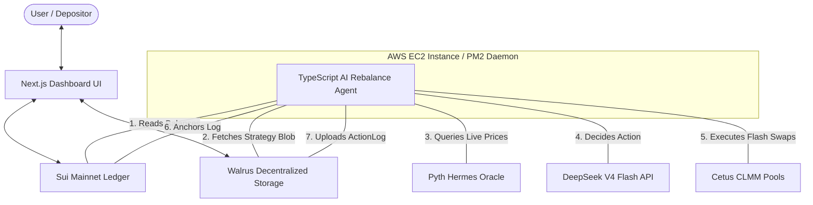

# SuiSyndicate 🌀
### Autonomous, Non-Custodial Multi-Strategy Portfolio Vaults on Sui Mainnet

SuiSyndicate is a DeFi hackathon-grade vault protocol that enables users to deposit SUI and USDC into autonomous, yield-rebalancing portfolios. The protocol operates under a strictly **non-custodial** trust model: an AI/deterministic rebalancer agent executes concentrated liquidity trades (via Cetus) to optimize allocations, but is cryptographically prevented from withdrawing or misdirecting user funds.

---

## 🏗️ System Architecture

SuiSyndicate is built on a four-tier architecture combining the speed of the Sui blockchain, the scalability of decentralized storage (Walrus), the intelligence of AI reasoning (DeepSeek), and a modern React interface.



---

## 🌟 Key Features

### 1. Cryptographically Enforced Non-Custodial Execution
The smart contracts use an **Agent-Cap/Hot-Potato Flash Loan** design. 
* To execute a trade, the agent borrows assets from the vault (`initiate_swap_sui`). This generates a **hot-potato receipt** (`SwapReceipt`) that has no abilities and cannot be dropped or stored.
* The only way to complete the transaction and destroy the receipt is by calling `resolve_swap_sui` in the same transaction block, which forces the agent to deposit the swapped asset back into the vault. 
* If the agent attempts to transfer the borrowed SUI or USDC to an external address, the transaction fails at the VM execution layer.

### 2. Multi-Strategy Rebalancing Engine
SuiSyndicate supports three strategies:
* **Target Allocation Rebalancing:** Restores portfolio balances back to a set target (e.g. 50% SUI / 50% USDC). If price movements deviate allocations beyond a threshold (e.g., 2%), the agent triggers a rebalance swap.
* **Grid Volatility Harvesting:** Buys SUI in grid tiers when the price drops (buying the dip) and takes profits in USDC as SUI rises.
* **Momentum Trend Follower:** Dynamically shifts vault targets (e.g., up to 80% SUI in bull trends, or down to 20% SUI in bear trends) by measuring price returns over configurable intervals.

### 3. Walrus-Anchored Strategy & Activity Logs
* **Strategies:** Vault strategies are uploaded to Walrus Storage as JSON blobs. Pointers (`blob_id`) are stored on the Sui vault object. The agent reads this blob dynamically, enabling gas-efficient off-chain updates.
* **Action Logs:** Every tick and swap decision is recorded in an `ActionLog` uploaded to Walrus, which anchors a cryptographic pointer on Sui via `LogAnchored` events. The frontend reads these log pointers to render portfolio charts and activity feeds.

### 4. Hybrid Decision Engine (AI + Local Fallbacks)
* Pre-calculated market metrics (e.g., rose/fell direction and exact percentage shifts) are sent alongside portfolios directly to the **NVIDIA DeepSeek V4 Flash** API to avoid calculation errors.
* If the DeepSeek API is rate-limited (HTTP 429) or offline (HTTP 500), the agent automatically triggers a **Local Deterministic Fallback** that executes identical mathematical rebalancing logic locally.

---

## 📁 Repository Structure

* [`/contracts`](file:///c:/Users/User/Desktop/sui%20syd/contracts) — Move smart contracts (`vault.move`, `actions.move`, `factory.move`).
* [`/sdk`](file:///c:/Users/User/Desktop/sui%20syd/sdk) — TypeScript SDK Wrapper client (`SuiSyndicateClient`, `WalrusClient`, `TatumClient`).
* [`/backend`](file:///c:/Users/User/Desktop/sui%20syd/backend) — TypeScript script runners, scenarios, and the live monitor loop (`agent-loop.ts`).
* [`/frontend`](file:///c:/Users/User/Desktop/sui%20syd/frontend) — Next.js client dashboard interface.

---

## 🚀 Running Locally

### 1. Prerequisites
Create a `.env` file at the root workspace directory:
```env
DEEPSEEK_API_KEY=your-nvidia-deepseek-key
TATUM_API_KEY=your-tatum-rpc-key
SUI_MAINNET_RPC=https://fullnode.mainnet.sui.io:443
PRIVATE_KEY=your-agent-wallet-suiprivkey
VAULT_ID=0x287a655c5e28dfcb01f1b4d139852986dab7f1dcfb46282f5b58ed70153d19c8
AGENT_CAP_ID=0xb27e48d6202543807a5f8895e64a8aca6dc42b1ae1acde78fa1be2a86d14f5d1
```

### 2. Install Dependencies
```bash
npm install
```

### 3. Build SDK
```bash
npm run sdk:build
```

### 4. Run Diagnostic Tests
Verify SUI Mainnet, Walrus replication, and NVIDIA APIs are working:
```bash
npm run test:connections
```

### 5. Launch UI Dashboard
```bash
npm run dev
```
Open [http://localhost:3000](http://localhost:3000) to view the application.

---

## 🖥️ AWS EC2 VM Deployment (PM2 Daemon)

To deploy the agent continuously on your EC2 instance:

1. Clone and install dependencies:
   ```bash
   git clone https://github.com/Etzkennyboi/new-sui-vault.git
   cd new-sui-vault
   npm install
   npm run sdk:build
   ```
2. Set up the `.env` file as described above.
3. Install PM2 globally:
   ```bash
   sudo npm install pm2 -g
   ```
4. Start the agent background daemon:
   ```bash
   pm2 start npm --name "suisyndicate-agent" -- run agent --workspace=backend
   ```
5. Monitor logs:
   ```bash
   pm2 logs suisyndicate-agent
   ```

